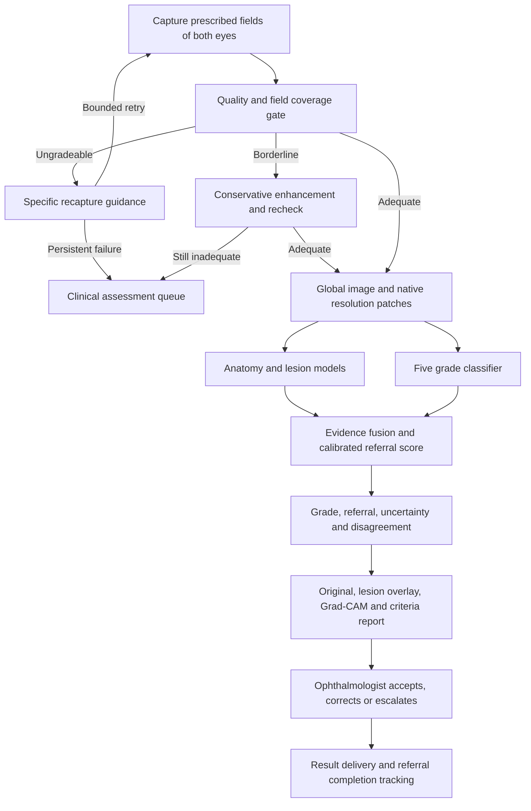

# MATLAB retinal screening: design and validation specification

Prepared 11 September 2026. This document specifies a research prototype and the evidence needed to accept it for the requested use. It does not report achieved clinical accuracy. The existing DRishti implementation is a starting point, with integration and clinical limitations listed below.

## 1. Intended use and architecture

Screen adults with diabetes using a predefined camera/field protocol. Produce an eye-level ICDR grade, a patient-level referral recommendation, image adequacy, evidence overlays, and a clinician-review record. The primary statistical endpoint is patient-level moderate-or-worse DR (grade >=2 in either eye). Keep suspected macular disease and ungradeable eyes as separate clinical escalation reasons; they must not become negative DR labels.

Preserve immutable originals, camera/laterality/field metadata, content hashes, coordinate transforms and model versions. Deduplicate recaptures and repeated uploads by examination and image identifiers. An unsupported camera, incomplete field protocol, failed required model or missing eye produces a review state, not an automatic grade 0. Confirmed disease in a visible eye can still justify referral while the other eye is ungradeable.

## 2. Quality assessment and enhancement

Use two complementary quality assessments: interpretable measurements and a learned three-class adequacy model trained against masked grader decisions (adequate, potentially recoverable, ungradeable). Tune thresholds using development data per supported camera; do not treat fixed Laplacian thresholds as universal.

| Dimension | Measurements and acceptance logic | Capture feedback |
|---|---|---|
| Focus | Green-channel Laplacian variance, gradient energy and vessel-edge visibility in local retinal tiles; exclude the FOV boundary | Refocus, stabilize, ask patient to fixate |
| Exposure | Saturated/dark pixel fractions within the retina, local contrast and spatial illumination variation | Adjust exposure/flash; reduce glare |
| Coverage | Retinal mask plus required optic-disc/macula visibility and field metadata | Recenter on the prescribed target and capture missing field |
| Occlusion/artifact | Eyelash, reflection, motion and media-opacity scores; empty/invalid masks fail closed | Clear obstruction or route persistent opacity for clinical assessment |

For borderline exposure/noise, estimate a smoothly varying background B in the green or luminance channel, normalize using I/(B+epsilon), then apply conservative CLAHE and edge-preserving denoising. MATLAB building blocks: `imgaussfilt`, `adapthisteq`, `imbilatfilt`, morphology and `regionprops`. Treat smoothing scale, CLAHE clip limit and tile size as validated parameters. Keep color features available for lesion discrimination.

Recheck after enhancement, but require preservation of original-image structural information. Enhancement cannot recover clipped highlights, missing fields or defocus information. Sharpening that merely raises a quality score is not evidence of recovered diagnostic detail. Train and evaluate the complete enhancement policy; compare original/enhanced lesion sensitivity and false-positive rates. Show both images to reviewers. Limit acquisition retries (e.g., two, subject to local protocol) and record the reason for persistent failure.

## 3. Anatomy and lesions

Use a global context branch (e.g., 512–1024 pixel input) alongside overlapping native-resolution patches (initial engineering choice: 512-pixel tiles with 25% overlap). Global downsampling is appropriate for context, not the sole input to tiny-lesion detection. Blend overlapping probability maps and deduplicate instances before counting. Retain transformations back to original coordinates, including half-pixel resize conventions.

| Output | Proposed method | Required evaluation |
|---|---|---|
| Optic disc and fovea | Landmark heatmap network plus disc segmentation; geometric relationships are plausibility checks, not hard assumptions | Landmark error normalized by disc diameter; disc Dice; failure detection |
| Vessels | U-Net-style segmentation, with multiscale matched-filter baseline; topology/skeleton features | PR-AUC, sensitivity, Dice and thin-vessel connectivity |
| Microaneurysms | Multiscale dark-blob candidates plus learned patch classifier/segmenter; hard negatives from crossings, pigment and small hemorrhages | Lesion FROC, one-to-one matching at a preregistered tolerance, size-stratified recall |
| Hard/soft exudates | Separate learned masks using color/context and disc localization | Per-class PR-AUC, Dice and instance recall; disc-adjacent error audit |
| Hemorrhages | Instance segmentation plus subtype head for dot/blot/flame and vitreous/preretinal hemorrhage where annotated | Instance recall and subtype confusion matrix, including uncertain subtype |
| Venous beading and IRMA | Dedicated annotated models with quadrant coverage and confidence | Grader-adjudicated lesion and quadrant agreement |
| Neovascularization | Dedicated NVD/NVE lesion model using original color, vessel appearance and disc distance | PDR sensitivity and NVD/NVE lesion precision; confusion with IRMA and normal arcades |

Dense or tortuous vessels alone do not establish neovascularization. Keep any such heuristic as an experimental review flag. Unassessed IRMA, beading or NV is unknown, not absent. Absence of a lesion in an unobserved peripheral field cannot rule out severe disease.

Sub-pixel means fractional-coordinate localization of a signal captured across pixels. Refine a resolved microaneurysm center through probability-weighted centroids or a local quadratic response fit, retaining localization uncertainty. Upsampling or super-resolution does not establish detection of lesions below the camera's optical/sampling resolution. Validate fractional-coordinate error using controlled targets and adjudicated real images; report the smallest reliably detectable lesion by camera and sampling scale. A fractional centroid alone is not a sensitivity result.

Store each finding with type, mask/instance ID, original-coordinate centroid, confidence, quadrant, size, source model and assessment state. Avoid counting an instance twice as both a microaneurysm and a hemorrhage. Quadrant assignment must follow a documented, laterality-aware clinical convention validated by graders; correct orientation before applying quadrant criteria.

IDRiD supplies lesion masks for microaneurysms, hemorrhages, hard and soft exudates, and anatomy/grade tasks. It does not by itself supply all labels needed for the proposed subtype, IRMA, beading and NVD/NVE models. Obtain additional adjudicated annotations for those tasks. [IDRiD data](https://idrid.grand-challenge.org/Data/)

## 4. Grading, fusion and calibration

| ICDR level | Evidence criterion |
|---|---|
| 0 — No apparent DR | No DR abnormalities in adequately assessed required fields |
| 1 — Mild NPDR | Microaneurysms only |
| 2 — Moderate NPDR | More than microaneurysms alone, below severe criteria |
| 3 — Severe NPDR | No PDR and any of: >20 intraretinal hemorrhages in each of four quadrants; definite venous beading in >=2 quadrants; prominent IRMA in >=1 quadrant |
| 4 — PDR | Neovascularization and/or vitreous/preretinal hemorrhage |

The five-level scale is the clinical target, with ungradeable/uncertain handled outside that ordinal scale. Macular edema is a separate assessment; a color photograph cannot directly establish retinal thickening. Flag suspicious macular findings for the appropriate examination rather than declaring DME absent. [Wilkinson et al., original scale](https://pubmed.ncbi.nlm.nih.gov/13129861/), [AAO scale table](https://eguideline.guidelinecentral.com/i/557414-diabetic-retinopathy/4)

Fine-tune a pretrained image classifier using `dlnetwork`/`trainnet` with patient-balanced sampling, class weighting and carefully bounded augmentations. Train the patch/lesion branches with masks and hard-negative sampling. Fit a small fusion model to out-of-fold image scores, lesion burden and quality/coverage features; do not train fusion on in-sample base-model predictions. Compare this with a CNN-only model and transparent lesion rules. Missing evidence gets explicit missingness indicators.

Fit temperature scaling on a dedicated calibration partition: p(k)=softmax(z(k)/T), T>0, minimizing negative log likelihood. If fusion changes the score, calibrate the final fused output. A separate correctness calibrator may estimate the probability that a displayed grade is correct, but cannot be substituted for five class probabilities. Evaluate calibration on untouched test data using Brier score, NLL, reliability plots and ECE, including camera/site strata.

Eye-level referable score is p(2)+p(3)+p(4). Predefine eye-to-patient aggregation (e.g., maximum eye score), then calibrate and tune that patient-level score independently; a maximum is not automatically a calibrated patient probability. Select the threshold on a threshold-selection partition, maximizing specificity subject to the sensitivity target. Freeze the complete policy before external testing. Report failure if no threshold meets both targets; a threshold cannot guarantee an unattainable operating point.

Require sensitivity >0.90 and specificity >0.85 on the locked patient test set. For stronger release evidence, preregister one-sided 95% lower confidence bounds above those values as the acceptance gate. Never tune on test labels. Distinguish the displayed most-likely grade from the thresholded referral decision: they can differ. Route disagreement, poor coverage, suspected PDR and uncertain findings for review. Measure the final clinician-assisted policy separately from autonomous model metrics.

## 5. Explainability and rapid review

Provide three synchronized panels: original image, lesion overlay, and labeled Grad-CAM attention. Generate Grad-CAM for the actual network class/channel or a custom differentiable referable score. Map grade labels through the model's saved class order; grade 0 is not channel index 0. Label which branch and output the heatmap explains: image-network attention does not explain all downstream fusion rules. [MATLAB Grad-CAM](https://www.mathworks.com/help/deeplearning/ref/gradcam.html)

The evidence table states lesion type, count/location, assessed coverage, confidence and the clinical criterion supported. Examples must be generated from measured findings, not a text model's inference. Show contradictions and unknowns. Attention is neither a lesion segmentation nor proof of causality. Audit with lesion overlap, controlled occlusion and model/random-label sanity checks, while accounting for normal context used by the classifier.

Report schema: pseudonymous examination ID; eye/field; original and derived image references; quality reasons; per-eye grades; patient referral score/threshold; evidence and uncertainty; model/calibration versions; timestamp; reviewer decision, correction and elapsed time. Export annotated PNG and structured JSON plus a printable report. Use deterministic clinical templates for the prototype.

Proposed reviewer flow: 0–5 s identify image quality and recommendation; 5–20 s inspect linked lesion crops and criteria; 20–30 s accept, correct or escalate. This is a usability target, not an achieved result or a deadline imposed on complex cases. Run a randomized, counterbalanced multi-reader study with and without explanations; include normal images, small lesions, false positives, uncertainty and severe disease. Measure paired time, diagnostic accuracy, harmful overrides and a prespecified usefulness scale. Suggested target for clinician agreement: median usefulness >=4/5 and median review <30 s, with p90/p95 reported. Decide whether the requirement instead means 90% or 95% of reviews under 30 s before study registration; do not substitute a median afterward.

## 6. District resource simulation

Model arrivals -> capture/retry -> store-and-forward upload -> MATLAB worker pool -> review -> report delivery -> referral attendance. Preserve patient/eye joins and distinguish image counts from examination counts. Use base Simulink rate/backlog blocks for planning; use the existing base-MATLAB discrete-event simulator for waiting-time distributions. SimEvents is optional and is not assumed to be part of the requested toolbox set.

For each fluid stage, with arrival rate a, capacity c and timestep dt: flow=min(c,a+Q/dt), Q_next=Q+dt*(a-flow). Use delayed queue state to prevent algebraic loops. Explicitly gate service by shift and downtime. Validate nonnegative queues, conservation, zero-resource cases, overload growth, daily drain and timestep convergence. Build/save with `new_system`, `add_block` and `save_system`. [MathWorks programmatic modeling](https://www.mathworks.com/help/simulink/programmatic-modeling.html)

At 100,000 patients over 250 working days, mean demand is 400 patients/day. At two images per patient and 3.5 MB/image, traffic before retry/protocol effects is 2.8 GB/day. At 11 seconds/image, compute service demand is about 2.44 worker-hours/day. Both image count and service time are assumptions: a two-field-per-eye protocol doubles the nominal image count, and high-resolution lesion inference must be benchmarked on target hardware.

Thirty seconds of review for every patient equals 3.33 review-hours/day before breaks, difficult cases and administration. Do not size all review using this aspirational number: use a measured mixture of rapid confirmation and longer adjudication service times. The existing simulation assumes 2.5 minutes per disagreement review and 1.5 minutes per QA case; its results do not establish the requested 30-second usability endpoint.

Referral demand is not disease prevalence. Before clinician adjudication, positive fraction = prevalence*sensitivity + (1-prevalence)*(1-specificity). At prevalence 10%, sensitivity 90% and specificity 85%, that is 22.5%, or 90 positive screens/day at 400 screens/day. A specialist working six hours at ten minutes per case has 36 slots/day; keeping utilization below 85% would require at least three such FTE if all positives proceed to that clinic. This is illustrative arithmetic at the requested performance boundary, not observed demand. Add persistent-ungradeable and other-disease referrals without double counting, and model how human adjudication changes referrals using measured data.

Optimize annual cost over sites/technicians, workers, bandwidth, reviewers and clinic slots, subject to >=100,000 completed screening episodes per year, coverage and referral-follow-through targets, report/referral SLAs, and an agreed utilization ceiling. Arrivals of 100,000 do not guarantee 100,000 completed screens. Queueing percentiles come from an entity simulation, not a fluid model. Evaluate joint configurations with multiple seeds and paired scenarios; report uncertainty and the tested search space, rather than claiming a global optimum from independent sweeps.

Stress tests: 150k/200k annual arrivals, clustered camps, 0.25–4 Mbps links, link outages with bounded local storage, worker failure, 2–4 fields per patient, increased ungradeability, shifted specificity, and higher PDR prevalence. Track p95 end-to-end/report/referral waits, unmet demand, single-eye/incomplete exams, cost per completed episode and session-hours utilization. Include weekends, holidays, rescheduling, loss to follow-up and patient transport constraints in deployment calibration.

## 7. Validation and published comparisons

Use separate patient-grouped training, model-selection, calibration, threshold-selection and locked test partitions. Keep both eyes, all fields, visits and duplicates from each patient together. Preserve official benchmark splits; record dataset versions, consent/license limits, hashes and adjudication provenance. Do not merge unrelated label systems into grade folders without verified mapping. Train on available licensed development data, test on untouched external cameras/sites and a prospective local cohort. Patient IDs that cannot be recovered limit defensible patient-level claims.

Reference standard: at least two masked qualified graders with adjudication, grading severity and adequacy independently of model output. Obtain reference outcomes for rejected/uncertain cases where possible; report verification missingness. Publish both accuracy among gradable cases and whole-cohort routing performance, rejection rate, automatic coverage and clinician burden. A review/abstention cannot simply disappear from the denominator or be silently counted as a correct negative.

Primary metrics: patient-level sensitivity/specificity with confidence intervals, TP/FN/TN/FP, AUROC/PR-AUC, PPV/NPV at observed prevalence and calibration. Secondary: five-class confusion matrix, macro recall, quadratic weighted kappa, PDR recall, lesion FROC, subtype precision and site/camera/quality subgroup results. Resample patients, not correlated images, for confidence intervals and paired comparisons. Prospectively size positive and negative cases: normal approximations such as n ~=1.96^2*p*(1-p)/d^2 are planning aids; exact/cluster-aware calculations and the lower-bound acceptance criterion determine final recruitment.

Run paired ablations on the same locked patients: (A) morphology/rules; (B) CNN alone; (C) CNN plus adaptive quality/enhancement policy; (D) CNN plus lesions; (E) complete fusion/calibration/review policy. Tune each automatic comparator on development data under the same sensitivity objective. Separate clinician-assisted comparisons from model-only comparisons. Use paired patient bootstrap intervals for changes in sensitivity/specificity and operational outcomes; apply a prespecified multiplicity correction across tested comparators. A valid conclusion is superiority over the tested baselines, never superiority over every possible single technique.

Published context: Gulshan et al. reported 97.5% sensitivity/93.4% specificity on EyePACS-1 and 96.1%/93.9% on Messidor-2 at their high-sensitivity operating point. Their referable endpoint included referable macular edema and their gradable-image analysis differs from an all-arrivals, patient-level grade>=2 endpoint. These are reference results, not DRishti results, and cannot support cross-study superiority. [Original JAMA study](https://jamanetwork.com/journals/jama/fullarticle/2588763)

Use IDRiD's official lesion annotations/evaluation protocol and a documented Messidor-2 reference-label source; images alone do not provide a trustworthy grade mapping. Keep any benchmark used during development out of external-validation claims. [Messidor-2 dataset](https://www.adcis.net/en/third-party/messidor2/)

## 8. MATLAB implementation contracts and delivery gates

| Module | Contract and toolbox role |
|---|---|
| Quality | `assessQuality(image,metadata,cfg)` returns status, reasons, ROI, metrics, original/enhanced references and coverage; Image Processing Toolbox |
| Anatomy/lesions | `inferStructures(original,enhanced,models,cfg)` returns probability maps, instances, landmarks and assessed/unknown fields; Image Processing + Deep Learning |
| Training | `trainModels(manifest,cfg)` saves network/class order/preprocessing/splits; Deep Learning; label/overlay tooling in Computer Vision |
| Decision | `gradeExam(eyeResults,models,cfg)` returns grades, calibrated patient referral score, threshold and review reasons; Statistics and Machine Learning |
| Explanation | `explainExam(exam,models,cfg)` returns actual-output Grad-CAM, evidence table and coordinate-linked crops; Deep Learning + Computer Vision |
| Medical data | Medical Imaging Toolbox for supported medical-image import/annotation workflows when present; ordinary RGB fundus photos retain their native 2-D geometry |
| Evaluation | `evaluateLockedCohort(predictions,reference,protocol)` reports patient-level metrics, coverage, CIs, calibration and paired ablations; Statistics and Machine Learning |
| Operations | Simulink builder plus entity simulator and joint capacity search; Simulink and base MATLAB |

These are proposed contracts, not new functions implemented by this document. Deliver in this order: (1) repair and smoke-test the existing integration, including fail-closed states; (2) train/evaluate quality and lesions at native resolution; (3) train fusion, calibrate and freeze thresholds; (4) generate real-case reports and conduct reader study; (5) execute Simulink model, validate conservation and compare with DES under matched assumptions; (6) complete external and prospective evaluation. Persist model hashes and calibration/threshold provenance in every report. Monitor camera/quality/calibration drift and audit reviewer overrides; retraining requires a new locked evaluation.

## 9. Current repository and runtime evidence

Source inspection found these unresolved issues in the existing prototype; no clinical inference code was changed as part of this design:

- `assessImageQuality` returns `processedImage`, while `runDRPipelineProduction` checks `qc.image`, bypassing the intended enhanced image.
- The runner loads the first MAT variable rather than reliably handling the documented flat model structure. Validate the complete model schema and class ordering.
- The runner calls `calibrateConfidence(probs,model)`, while that function fits on numeric confidence/correctness arrays or applies a stored calibrator first. It models grade correctness, not calibrated multiclass probabilities.
- The runner passes a grade as a Grad-CAM class index; grade 0 and a NaN disagreement grade are invalid choices. Explain an explicit valid model output, while reporting the uncertain final decision separately.
- Calls to `explainGrading` and `compileReportData` do not match their declared function signatures.
- `segmentRetina` returns an NV struct while `gradeByRules` applies `any` directly to the selected field. The NV adapter must handle assessment state and `.found` explicitly, and must not convert the heuristic into confirmed PDR.
- The segmentation working image is capped at a 1024-pixel long side. Upsizing its masks to original dimensions does not prove native-resolution or sub-pixel microaneurysm detection.
- Missing severe-disease evidence defaults to absent in the rule path. Unknown coverage/IRMA/beading/NV requires explicit review handling.
- The existing capacity model treats a configured referable proportion as referral demand. Its baseline resource conclusions must be revisited using actual final-policy positives, persistent rejections and follow-through.

Runtime check on 11 September 2026: MATLAB R2026a starts outside the filesystem sandbox. `exist(...,'file')` returned 0 for `adapthisteq`, `dlnetwork`, `perfcurve` and `new_system`. A Simulink license entitlement returned true, but that does not establish installed Simulink functions. Consequently, retinal inference, training, Grad-CAM and the Simulink builder could not be executed in this environment. The existing `drishtiCapacityDES(drishtiParams())` completed successfully using base MATLAB.

Acceptance status: design specified; base-MATLAB capacity simulation executed; integrated image prototype not verified; installed toolbox prerequisites missing; clinical >90%/>85%, reader usefulness/<30 s, validated Simulink behavior, and superiority over tested baselines remain unproven. The supplied demo checkpoint is not a substitute for those studies.
